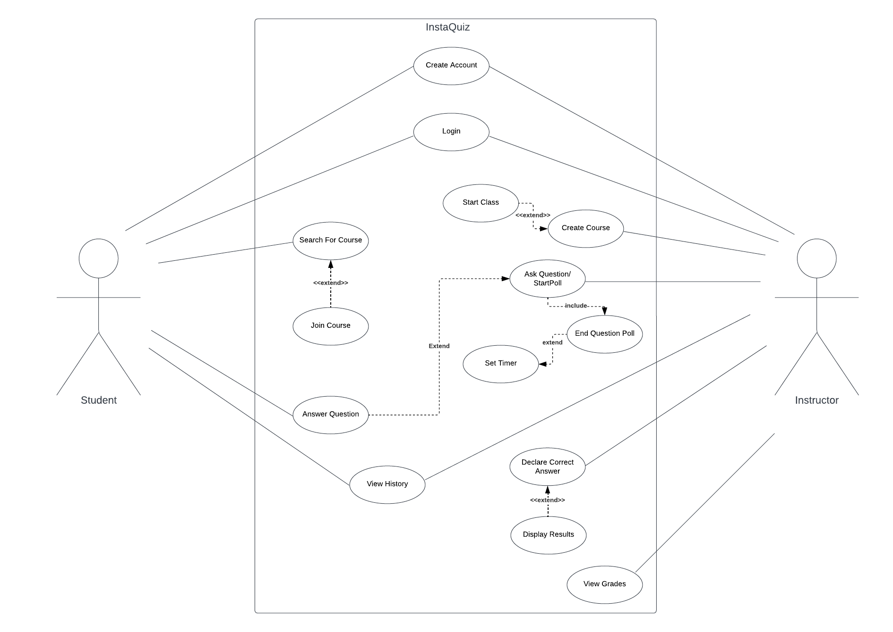

# **InstaQuiz Requirements Document**
## **1. Introduction:**  
1.1 Purpose of the requirements document

The purpose of this SRS document is to define and describe the functions and specifications of the InstaQuiz polling and feedback software. The document illustrates, in clear terms, what the system will do and what the user should expect. This will serve as a reference for the development team.

1.2 Scope of the product

The software we are describing is called InstaQuiz, or IQ for short. InstaQuiz is a cloud based live service polling program which allows instructors to display custom questions to their students, and receive their responses to be marked in real time. The system will run on a live webpage, which will be reinforced by a login system using emails and custom passwords with certain requirements. When signing up for an account, InstaQuiz will ask the user to declare which privileges they require, they are able to choose between an instructor, or student account. Instructors can create course modules, which will act as the real-time virtual meeting place for their students. Students can search for, and join these course modules online. Polls can then be initialized or terminated within these courses and students registered to the course can participate. These polls will provide live feedback to both the students and instructors about how well the students are grasping the current material.  A hashing function will be deployed for the limited sensitive data stored (see section 2.4 General Constraints). Control over live sessions (starting, ending, polling questions, etc.) will only be given to the instructors that created the course.

1.3 Definitions, acronyms, and abbreviations  

 

\
1.4 References

IEEE Standard 830-1998

1.5 Overview of the remainder of the document 

The remainder of the document will detail the general aspects of the application such as, application functions, characteristics of the expected users, assumptions regarding application use, and general constraints. Formal requirement descriptions such as the user, interface, functional and non-functional requirements are also provided along with a use-case diagram and journey line.

## **2. General description**  
2.1 Product Perspective

The system will be developed using Java and deployed on a desktop computer. The website will be accessible to all but will require logging in as either an instructor or as a student. The interfaces will run on any web browser and require no additional downloads or software packages by users.

2.2 Product Functions

The InstaQuiz system will provide all of the following features, however, the user’s access to certain features will depend on whether the user is logged in as a student or instructor. The system also has some general features such as maintaining data that are now user dependent.

* InstaQuiz will keep record of all the courses that have been created by instructors and store data about them such as the course title, and the name of the instructor
* Students and instructors can create an account using an email and password
* Students and instructors can log in to the system 
* Students can search for courses by course title
* Students can enroll in courses 
* Students can see a menu of the courses they have enrolled in and edit the courses they are currently enrolled in.
* Instructors can start a live InstaQuiz session
* Students can join the live InstaQuiz session for any of the courses the are enrolled in provided the instructor has started the session (i.e. class is live)
* Instructors can create questions with multiple choice answers. 
* Instructors can poll the class with the questions they have created.
* Students will be able to answer the multiple choice questions
* Students will be able to change their answers while the poll is live
* While the poll is open instructors and students will see how many students have submitted an answer
* Instructors will be able to end the poll at any time and select a correct multiple choice option which will be displayed on screen to the entire class
* Students will then be able to see whether they answered correctly or not
* Instructors can see how their students answered the questions and the specific distribution of answers
* Students and instructions will also see a distribution of answers selected once a poll has been closed
* Students can see how many questions they have answered right for a particular course and how many sessions they have joined (i.e. their attendance). 
* Students and instructors can view the InstaQuiz history for a course which will show all past polls and their correct answers.

\
2.3 User Characteristics

The demographic for our InstaQuiz software is mostly people in the education field, primarily instructors and students with access to the internet and a web browser. It is assumed that users are familiar with basic webpage traversal and online concepts such as login credentials and account privileges. Instructors planning to use InstaQuiz will be capable of typing custom questions and providing corresponding answers.

2.4 General Constraints

While security is always a priority, the InstaQuiz system does not store any personal information about its users so there is not much data to protect. Because of this, there will not be a limited number of failed login attempts. Emails and passwords will, however, be hashed before being stored to protect from malicious attacks. Instructors and students will also not be limited to a certain number of course creations or enrollments respectively, and  student accounts will be able to search for and join courses where they can participate in polls. Students will be constrained however as they will not be able to create courses or edit course details the same way instructors can. The beauty of the InstaQuiz system is that it is a tool for those looking to further their education so we can assume the majority of users will not mess around or miss using the software. And due to the simple nature of the InstaQuiz system interaction, any so called miss use would not cause problems for any other users therefore no constraints are necessary. The only potential negative effects would be answer distributions could be skewed but this already happens in any class polling scenario as you can’t prevent participants from answering randomly or incorrectly. 

2.5 Assumptions and Dependencies

As this is an educational aid, we have made certain assumptions about the use of our system. We assume student users won't bother joining additional courses and answering polls for classes they aren’t taking, therefore no limitations were enforced in this area (see above section). Similarly, we assume professors won’t enroll in courses and answer other instructors' polls as if they were a student. We have also made assumptions about our target demographic. We assume all users will have stable internet access, a device to use InstaQuiz on, and are fluent in English.

## **3. Specific requirements**
3.1 User

      3.1.1 Users can create an InstaQuiz account with instructor, or student privileges using their email address and a custom password.
      3.1.2 Users can login to their InstaQuiz accounts using their email address and password.
      3.1.3 Users can logout by clicking a constantly displayed button in the top right of the web-page.
      3.1.4 Instructors can create a new course module, this automatically enrolls them in the course, as the instructor.
      3.1.5 Instructors can delete any course module they have personally created.
      3.1.6 Users can search for a course module by title or instructor
      3.1.7 Users can enroll in any course module that they are not currently enrolled in. 
      3.1.8 Instructors and students can unenroll from a course they are currently enrolled in.
      3.1.9 Instructors can start a live course session in any courses they have created.
      3.1.10 If an instructor has any ongoing live sessions, they can end them whenever, as long as no polling windows are active.
      3.1.11 Users can join a live course session, provided that the instructor has started it already.
      3.1.12 Instructors can create a storage bank of custom questions with corresponding multiple choice answer sets.
      3.1.13 Instructors can start a polling window during a live session as long as no other polls are already in progress.
      3.1.14 Instructors can end their live polling window and declare the correct answer to the question. 
      3.1.15 Users can answer a question by clicking on the corresponding answer listed beneath the question text. A user can change their answer during the polling window.
      3.1.16 Instructors can choose to display a summary of the question, (correct answer, how many votes each answer got, how many total responses, etc.) or to keep it hidden from the class. Instructors will be able to see this summary regardless after they end a polling window. 
      3.1.17 For each course they are enrolled in, students will be able to see their current score, attendance record, and response history throughout previously attended live sessions.
      3.1.18 For each course they have created, instructors will have access to their student’s grades, attendance records, and response history. 

3.2 Interface

      3.2.1 Students have an overview page which displays each course they are enrolled in, and gives them the option to join a class, or unenroll from one.
      3.2.2 Students can access course pages from the overview page where they will then be able to view their course statistics and join live sessions that are currently running.
      3.2.3 During a polling window, the question statistics are displayed and updated in real-time.
      (How many students have answered/ not answered)

3.3 Functional 

      3.3.1 InstaQuiz will keep record of all the courses that have been created by instructors and store data about them such as their title, name of instructor, and course code made up of the faculty abbreviations and course number (ex COSC 310)
      3.3.2 Students and instructors can create an account using an email and password which they will use to login to the system.
      3.3.3 Students can search for courses by course title and enroll in the courses they search for and select. They will also be able to see a menu of the courses they have enrolled in and edit the courses they are currently enrolled in.
      3.3.4 Instructors can start a live InstaQuiz session. Students who have enrolled in a course can join the session provided their instructor has started an InsatQuiz session (i.e. class is live).
      3.3.5 Instructors can create questions with multiple choice answers and poll the class with the questions they have created.
      3.3.6 Students will be able to answer  multiple choice questions during an InstaQuiz session, they can change their answers as many times as they want while the poll is live. While the poll is open instructors and students will see how many students have submitted an answer
      3.3.7 Instructors will be able to end the poll at any time and select a correct multiple choice option which will be displayed on screen to the entire class. Students will then be able to see whether they answered correctly or not
      3.3.8 Instructors can see how their students answered the questions and the specific distribution of answers. Students and instructions will also see this distribution of answers selected once a poll has been closed
      3.3.9 Students can see how many questions they have answered right for a particular course. The total questions asked for the course will also be shown so the student will see a comprehensive score, something like 16/21. 
      3.3.10 Students and instructors can view the InstaQuiz history for a course which will show all past polls and questions with the corresponding correct answers.

3.4 Non-Functional

      3.4.1 Web service must update in real-time, users are given varying time windows to submit responses. We must minimize response times to and from the main client.
      3.4.2 Web service must be able to handle large amounts of traffic. As an international education tool, thousands of academics may be on the site at one time. Live sessions must be able to support over 300 connected clients at a time.

## **Use Case Descriptions** 
\
**Use Case 1. Create Account**

    Primary actor: Student, Instructor
    Description: User can create an InstaQuiz account by entering their email and setting up a password.
    Pre-condition: Must set a password with a length of atleast 6 characters. 
    Post-condition: Account is created.

    Main scenario:
    1. User selects either "Student" or "Instructor" on the home page.
    1. User clicks on "Create account"
    2. User enters their email.
    3. User sets a password with a length of 6 or more characters.
    4. Account created.

**Use Case 2. Log In**

    Primary actor: Student, Instructor
    Description: User can log into their account in order to use InstaQUiz.
    Pre-condition: Must have an account created. 
    Post-condition: User is logged in.

    Main scenario:
    1. User selects either "Student" or "Instructor" on the home page.
    1. User clicks on "log in"
    2. User enters their email.
    3. User enters their password.
    4. User is logged in.

    Extensions:
    2.1 There is no account associated with the email address.
      2.1.1 "No account found" message is displayed.
    3.1 Password is invalid (does not match email).
      3.1.1 "Wrong password message is displayed".

 **Use Case 3. Search For Course**

    Primary actor: Student
    Description: Student searches for course they want to join for multiple choice question exercises.
    Pre-condition: Must be logged in.
    Post-condition: Course(s) found will be displayed.

    Main scenario:
    1. Student searches for their educational institution
    2. Student searches for their course by faculty code and course number

    Extensions:
    1.1 Educational institution not found
      1.1.1 “Institution not found” message is displayed
    2.1 Course not found
      2.1.1 “Institution not found” message is displayed

**Use Case 4. Join Course**

    Primary actor: Student
    Description: Once a course is found the student can join.
    Pre-condition: Student is logged in and found their course.
    Post-condition: Student is a part of the course.

    Main scenario:
    1. Student clicks on their course in search results.
    2. Student clicks on join to join that course.
    3. Student is officially enrolled in the selected course on InstaQuiz.

**Use Case 5. Create Course**

    Primary actor: Instructor
    Description: Instructor can create a new course to manage InstaQuiz questions.
    Pre-condition: Logged in and verified instructor.
    Post-condition: New course is created.

    Main scenario:
    1. Instructor clicks create new course.
    2. Fills in course information (Name, code, faculty, etc).
    3. Instructor submits form to set up new course

    Extensions:
    2.1 Required fields not filled in correctly.
      2.1.1 Error message displayed below fields.
	  2.1.2 Form cannot be submitted until corrected.

**Use Case 6. Start Class**

    Primary actor: Instructor
    Description: Instructor starts a class session for students to join.
    Pre-condition: Logged in and course exists.
    Post-condition: Class is active and students can join session.

    Main scenario:
    1. Instructor navigates to course page.
    2. Instructor clicks start class.
    3. Class session has started.

**Use Case 7. Ask a Question**

    Primary actor: Instructor
    Description: Instruction starts a poll so students can answer online.
    Pre-condition: Logged in and class session is active.
    Post-condition: Question is active for students in the session to answer.

    Main scenario:
    1. Instructor types and submits a question prompt.
    2. Question is displayed for students to answer.

**Use Case 8. End Question Poll**

    Primary actor: Instructor
    Description: The instructor ends the question poll after a desired length of time.
    Pre-condition: Question has been asked.
    Post-condition: Students can no longer answer the question. The results of the poll are captured.

    Main scenario:
    1. Instructor leaves poll open for a desired length of time.
    2. Instructor closes the poll.
    3. Question is closed for submission.

    Extensions:
    1.1 Instructor sets a timer to automatically close the poll.
      1.1.1 Once the set amount of time has elapsed, the poll closes.

**Use Case 9. Declare Correct Answer**

    Primary actor: Instructor
    Description: After an instructor closes a polling window to their question, they are immediately prompted to declare the correct answer. The software will not continue until a correct answer has been chosen, but the instructor can keep it hidden from their students if they wish. (See Use Case 10)
    Pre-condition: A user with instructor priveleges must be logged in, and a polling window for a question must have started and ended.
    Post-condition: The question object will receive a character value (A - E) that corresponds to the letter choice that represents the declared correct answer. The instructor is then given the choice to reveal the correct answer to their class.

**Use Case 10. Display Results**

    Primary actor: Instructor
    Description: After choosing the correct answer, the instructor can choose to display a representation of the student responses (How many students chose each answer), along with the correct answer to the question.
    Pre-condition: A user with instructor priveleges must be logged in. A question must have been asked, and a correct answer must have been declared.
    Post-condition: If the instructor chooses to, a visual representation of the student responses will print to all user clients currently in  the session. Alongside the data will be the correct answer expressed as a character (A through E).

    Main scenario:
    1. Instructor starts a class session and asks a question.
    2. Students provide their responses during the polling window on their own devices.
    3. Instructor ends the polling window when enough responses are in.
    4. Instructor is prompted to declare the correct answer. (Drop-down menu with choices A - E)
    5. The instructor can choose to display the results to the question on all student devices.
    6. Results disappear when the next polling window is opened.

    Main scenario:
    1. Instructor starts a class session and asks a question.
    2. Students provide their responses during the polling window on their own devices.
    3. Instructor ends the polling window when enough responses are in.
    4. Instructor is prompted to declare the correct answer. (Drop-down menu with choices A - E)

**Use Case 11. Answer a Question**

    Primary actor: Student
    Description: Student selects one of the multiple choice answers to a question.
    Pre-condition: Student is logged in and part of course; instructor has activated a question.
    Post-condition: Student's answer is recorded and results are reported.

    Main scenario:
    1. Student joins online class.
    2. Student clicks multiple choice option for their answer.
    3. Answer gets submitted when instructor closes the question.

    Extensions:
    3.1 No answer submitted.
      3.1.1 “No answer” message displayed and answer counted wrong

**Use Case 12. View Grades**

    Primary actor: Instructor
    Description: Instructor is able to view overall grades for all students in the course.
    Pre-condition: Logged in and course exists.
    Post-condition: Report with students grades generated.

    Main scenario:
    1. Navigates to course page.
    2. Goes to Grades tab in webpage.
    3. All student grades are presented and can be exported.

**Use Case 13. View History**

    Primary actor: Student, Instructor
    Description: User is able to view all the past questions and answers for a selected course.
    Pre-condition: Logged in and enrolled in course.
    Post-condition: Questions and answers from previous sessions are displayed.

    Main scenario:
    1. Navigates to course page.
    2. Goes to history tab in webpage.
    3. History is displayed.

## **Use Case Diagram**

## **Journey Line Diagram**
 